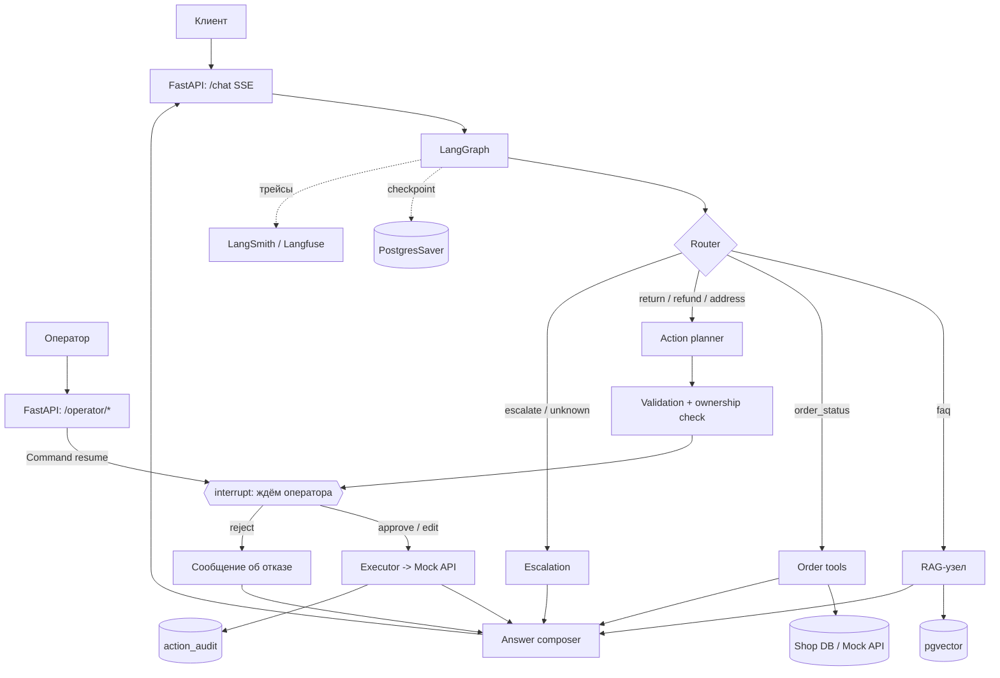

# ТЗ: Support Agent — ИИ-агент поддержки интернет-магазина

> Портфолио-проект на Python: RAG по базе знаний + инструменты (tools) + оркестрация на LangGraph + подтверждение рискованных действий оператором.
> Документ — рабочее ТЗ; после завершения проекта его можно превратить в README.

---

## 1. Общие сведения

**Название:** Support Agent
**Тип:** backend-сервис с чат-API (и опциональным минимальным веб-интерфейсом)
**Цель:** реализовать агента первой линии поддержки вымышленного интернет-магазина, который самостоятельно решает типовые обращения, а рискованные действия выполняет только после подтверждения оператором-человеком.

**Зачем проект (цель для автора):** показать на одном законченном проекте практику по Python, LangChain, LangGraph, RAG, векторному поиску, tool calling, human-in-the-loop, оценке качества и безопасности LLM-систем.

### 1.1. Легенда

Вымышленный магазин электроники и аксессуаров «TechShop». Данные (товары, клиенты, заказы) и база знаний — **синтетические**. Реальные данные, в том числе клиентов из прошлых проектов, не используются.

### 1.2. Границы (что не входит)

- Реальные платёжные и логистические интеграции: вместо них mock-сервисы.
- Голосовой канал, мессенджеры, мультиязычность (только русский).
- Fine-tuning моделей.
- Претензия на промышленную готовность (есть претензия на инженерную аккуратность, измеримость и безопасность).

---

## 2. Роли и сценарии

| Роль | Описание |
|---|---|
| **Клиент** | Общается с агентом в чате. Авторизован (в проекте — упрощённо, по токену/ID клиента). |
| **Оператор** | Видит очередь действий, требующих подтверждения, и принимает решение: одобрить / отклонить / изменить. |
| **Администратор (опционально)** | Обновляет базу знаний, смотрит метрики и трейсы. |

### 2.1. Ключевые сценарии

1. **Вопрос по правилам:** «Сколько дней у меня есть на возврат наушников?» → ответ по базе знаний со ссылкой на источник.
2. **Статус заказа:** «Где мой заказ 10452?» → агент проверяет, что заказ принадлежит клиенту, вызывает инструмент, отвечает.
3. **Возврат товара:** «Хочу вернуть заказ 10452, товар бракованный» → проверка допустимости возврата по правилам и данным → создание заявки на возврат → **подтверждение оператором**.
4. **Возврат денег:** сумма выше порога или нестандартная причина → **обязательное подтверждение оператором**.
5. **Изменение адреса доставки:** возможно только до отгрузки → подтверждение оператором.
6. **Эскалация:** агент не уверен, база знаний не содержит ответа, клиент раздражён или просит человека → создаётся тикет для оператора с кратким резюме диалога.
7. **Атаки и злоупотребления:** запрос чужого заказа, попытка «уговорить» агента выдать деньги, инъекция в тексте комментария к заказу → корректный отказ / эскалация.

---

## 3. Функциональные требования

### 3.1. Диалог и маршрутизация

- **FR-1.** Агент принимает сообщения клиента, ведёт историю диалога (в рамках `thread_id`).
- **FR-2.** Маршрутизатор определяет намерение: `faq | order_status | return_or_refund | address_change | escalate | smalltalk_or_unknown`.
- **FR-3.** Для неопределённых или пограничных запросов агент задаёт **один** уточняющий вопрос либо эскалирует.
- **FR-4.** Ответы даются на русском, в вежливом нейтральном тоне, без выдуманных фактов.

### 3.2. База знаний (RAG)

- **FR-5.** База знаний: 40–60 статей (доставка, оплата, возврат, гарантия, акции, бонусы, работа поддержки).
- **FR-6.** Ответы на вопросы по правилам строятся **только** на найденных фрагментах и содержат ссылки на источники.
- **FR-7.** Если релевантный контекст не найден — агент честно сообщает об этом и предлагает эскалацию.

### 3.3. Инструменты (tools)

| Инструмент | Тип | Подтверждение |
|---|---|---|
| `search_kb(query)` | чтение | не нужно |
| `get_order_status(order_id)` | чтение | не нужно |
| `get_order_details(order_id)` | чтение | не нужно |
| `check_return_eligibility(order_id, item_id)` | чтение / расчёт | не нужно |
| `create_return_request(order_id, item_id, reason)` | запись | **нужно** |
| `issue_refund(order_id, amount, reason)` | запись, финансовый риск | **обязательно** |
| `update_delivery_address(order_id, new_address)` | запись | **нужно** |
| `escalate_to_human(summary, priority)` | запись (тикет) | не нужно |

- **FR-8.** Каждый инструмент имеет строгую схему параметров (Pydantic) и описание.
- **FR-9.** **Проверка владения:** любой инструмент, работающий с заказом, проверяет, что заказ принадлежит текущему клиенту. Проверка делается **в коде**, а не в промпте.
- **FR-10.** Параметры, выбранные моделью, валидируются кодом до исполнения (существование заказа, допустимая сумма, статус заказа).

### 3.4. Политика подтверждений (human-in-the-loop)

- **FR-11.** Все инструменты «запись» выполняются только после явного подтверждения оператором.
- **FR-12.** Оператор получает карточку: что хочет клиент, что предлагает агент, параметры действия, релевантные фрагменты правил, результат проверок.
- **FR-13.** Решения оператора: `approve`, `reject` (с причиной), `edit` (изменить параметры, например сумму).
- **FR-14.** Клиент получает понятное сообщение о результате; при отклонении — объяснение без раскрытия внутренних деталей.
- **FR-15.** Все действия и решения пишутся в журнал аудита (кто, что, когда, с какими параметрами, результат).
- **FR-16.** Повторное подтверждение одного и того же действия не приводит к повторному исполнению (идемпотентность).

### 3.5. Эскалация

- **FR-17.** Эскалация создаёт тикет с резюме диалога, намерением клиента, шагами, которые уже выполнены, и приоритетом.
- **FR-18.** Триггеры: нет ответа в базе знаний, низкая уверенность маршрутизации, негатив/срочность, запрос человека, повторный отказ агента, ошибки инструментов.

### 3.6. API

- **FR-19.** `POST /chat` — сообщение клиента; ответ стримится (SSE): статусы шагов и токены ответа.
- **FR-20.** `GET /operator/approvals` — очередь ожидающих подтверждений.
- **FR-21.** `POST /operator/approvals/{id}/decision` — решение оператора.
- **FR-22.** `GET /threads/{id}` — история диалога и состояние.
- **FR-23.** Аутентификация клиента и оператора (упрощённые токены), у оператора отдельные права.

---

## 4. Нефункциональные требования

| Область | Требование |
|---|---|
| **Безопасность** | Проверка владения заказом в коде; минимизация PII в промптах и логах; защита от prompt injection (см. п. 7); секреты только через `.env`. |
| **Надёжность** | Таймауты и ограниченное число повторов для вызовов модели и инструментов; корректная деградация до эскалации при сбоях. |
| **Наблюдаемость** | Трейсинг каждого запроса (путь по графу, вызовы инструментов, токены, задержки). |
| **Производительность** | Ориентир: p95 ответа на FAQ ≤ ~8 с при стриминге первого токена ≤ ~2 с (целевые значения уточняются по результатам замеров). |
| **Стоимость** | Замер и отчёт по стоимости одного диалога; дешёвая модель для роутинга. |
| **Воспроизводимость** | Запуск одной командой (`docker compose up`), фиксированные версии зависимостей. |
| **Качество кода** | Типизация, линтер, тесты, CI. |

---

## 5. Архитектура

### 5.1. Схема



### 5.2. Стек

- **Язык / API:** Python 3.11+, FastAPI, Pydantic v2.
- **Агенты:** LangGraph (StateGraph, checkpointer, interrupt), LangChain (модели, tools, retriever).
- **Модели:** через OpenRouter, конфигурируемые (модель роутера и основная модель — раздельно).
- **БД:** PostgreSQL + pgvector; SQLAlchemy, Alembic.
- **Наблюдаемость:** LangSmith или Langfuse.
- **Тесты:** pytest, pytest-asyncio, httpx.
- **Инфраструктура:** Docker, Docker Compose, GitHub Actions.
- **Опционально:** React/Next.js — чат клиента и панель оператора.

> Версии LangChain/LangGraph фиксируйте в `pyproject.toml` и сверяйтесь с актуальной документацией: сигнатуры и названия могут отличаться между релизами.

### 5.3. Модель данных (основное)

- `customers(id, name, email, tier)`
- `products(id, name, category, price, warranty_months)`
- `orders(id, customer_id, status, created_at, shipped_at, delivered_at, address, total)`
- `order_items(id, order_id, product_id, qty, price, is_returnable)`
- `return_requests(id, order_id, item_id, reason, status, created_by, created_at)`
- `refunds(id, order_id, amount, reason, status)`
- `tickets(id, thread_id, summary, priority, status)`
- `approvals(id, thread_id, action_type, params_json, status, operator_id, decided_at, comment)`
- `action_audit(id, thread_id, actor, action, params_json, result_json, created_at)`
- Служебные таблицы LangGraph checkpointer и векторное хранилище (pgvector).

### 5.4. Состояние графа (пример)

```python
from typing import Annotated, Literal, TypedDict
from langchain_core.messages import AnyMessage
from langgraph.graph.message import add_messages

Intent = Literal["faq", "order_status", "return_or_refund",
                 "address_change", "escalate", "unknown"]

class SupportState(TypedDict):
    messages: Annotated[list[AnyMessage], add_messages]
    customer_id: str
    intent: Intent | None
    intent_confidence: float | None
    retrieved_docs: list[dict]
    order_context: dict | None
    proposed_action: dict | None      # {"type": "issue_refund", "params": {...}}
    validation: dict | None           # результаты проверок политики
    approval: dict | None             # решение оператора
    ticket_id: str | None
    usage: dict                       # токены, стоимость, задержки по узлам
```

### 5.5. Подтверждение оператором (пример)

```python
from langgraph.types import interrupt, Command

def await_operator(state: SupportState):
    decision = interrupt({
        "action": state["proposed_action"],
        "validation": state["validation"],
        "sources": state["retrieved_docs"],
    })
    return {"approval": decision}   # {"status": "approve"|"reject"|"edit", "params": {...}, "comment": "..."}

# Возобновление из /operator/approvals/{id}/decision:
# graph.invoke(Command(resume=decision), config={"configurable": {"thread_id": thread_id}})
```

Для `interrupt` требуются checkpointer и `thread_id`.

---

## 6. База знаний

- 40–60 статей в markdown: короткие, структурированные, с явными заголовками; часть намеренно содержит **исключения и оговорки** (чтобы проверять внимательность ответа).
- Часть вопросов должна иметь **ответ «в базе знаний нет»** — для проверки честного отказа.
- Статьи синтетические; в README это указывается прямо.
- Чанкинг: по заголовкам с ограничением размера; метаданные — статья, раздел, дата версии.
- Embeddings: модель с поддержкой русского (выбор обосновать в ADR по результатам замеров).

---

## 7. Безопасность и политика

**Принципы:** модель — не источник авторизации. Все права и лимиты проверяются кодом.

| Угроза | Мера |
|---|---|
| Запрос чужого заказа | Проверка `order.customer_id == state.customer_id` в каждом инструменте. |
| «Уговорить» на возврат денег | Финансовые действия — только через подтверждение оператора; лимиты суммы в коде. |
| Prompt injection в данных (комментарий к заказу, текст статьи) | Данные подаются как «недоверенный контент», инструкции из них игнорируются; инструменты ограничены схемой; тесты на инъекции. |
| Утечка PII | Маскирование в логах и трейсах; в контекст модели попадает только необходимое. |
| Зацикливание / расход бюджета | Лимит шагов графа, таймауты, лимит токенов на диалог. |
| Повторное исполнение действия | Идемпотентные ключи, статусы в таблице `approvals`. |

Набор red-team тестов (15–25 кейсов) входит в обязательную часть проекта.

---

## 8. Оценка качества (eval)

| Набор | Размер (ориентир) | Что измеряем |
|---|---|---|
| **Routing** | 60–80 фраз | Accuracy, confusion matrix, доля ошибок на пограничных формулировках |
| **RAG** | 40–60 вопросов | Hit@k / MRR, корректность ссылок, доля честных «не знаю» на вопросах без ответа |
| **Answer quality** | 40–60 ответов | По рубрике: опора на источники, полнота, отсутствие выдумок (LLM-as-judge + ручная проверка выборки) |
| **Tool use** | 40–50 сценариев | Верный инструмент, верные параметры, отсутствие лишних вызовов |
| **Policy / safety** | 20–30 кейсов | Ноль исполненных «записей» без подтверждения; отказ на чужие заказы; устойчивость к инъекциям |
| **End-to-end** | 20–30 диалогов | Достигнут ли правильный исход (ответ / заявка / эскалация) |
| **Cost / latency** | на всех прогонах | p50/p95 задержки, токены, стоимость диалога |

Результаты прогонов сохраняются в `evals/reports/`, а сводная таблица — в README.

---

## 9. Структура репозитория

```
support-agent/
├── README.md
├── docker-compose.yml
├── pyproject.toml
├── .env.example
├── alembic/
├── data/
│   ├── kb/                    # статьи базы знаний
│   └── seed/                  # генератор синтетических данных
├── src/support_agent/
│   ├── config.py
│   ├── api/                   # клиентские и операторские роуты, SSE
│   ├── graph/
│   │   ├── state.py
│   │   ├── router.py
│   │   ├── build.py
│   │   └── nodes/             # faq.py, orders.py, actions.py, escalate.py, answer.py
│   ├── rag/                   # ингест, чанкинг, retriever
│   ├── tools/                 # схемы и реализации инструментов
│   ├── policy/                # лимиты, правила, проверка владения
│   ├── mock_shop_api/         # имитация магазина
│   └── observability/
├── evals/
│   ├── datasets/
│   ├── run_evals.py
│   └── reports/
├── redteam/                   # атакующие сценарии
└── tests/
```

---

## 10. Этапы разработки

Оценка времени — при плотной работе; при параллельной учёбе/работе умножайте на 1,5–2.

### Этап 0. Подготовка (1–2 дня)

**Задачи**
- Создать репозиторий, `pyproject.toml`, ruff, pre-commit, базовый CI (линтер).
- Зафиксировать версии зависимостей; прочитать актуальные разделы документации: agents, StateGraph, persistence, interrupts, streaming.
- Написать `docs/scope.md` и `docs/decisions.md` (журнал решений — ADR своими словами).
- Выбрать модели в OpenRouter (дешёвая для роутинга, основная для ответов).

**Результат:** аккуратный пустой репозиторий, `.env.example`, зелёный CI.
**Критерий приёмки:** проект клонируется и проходит линтер на чистой машине.

---

### Этап 1. Инфраструктура, данные, mock-магазин (2–3 дня)

**Задачи**
- `docker-compose.yml`: PostgreSQL + pgvector, приложение, mock-сервис магазина.
- Миграции (Alembic) по модели данных п. 5.3.
- Генератор синтетических данных: 50–100 клиентов, 100–200 товаров, 500–1000 заказов в разных статусах, часть заказов с «особенностями» (просрочен срок возврата, товар не подлежит возврату, заказ уже отгружен).
- Mock Shop API: получение заказа, создание заявки на возврат, возврат средств, смена адреса, тикеты — с валидацией и логированием.
- Упрощённая аутентификация: токены клиента и оператора.

**Результат:** `docker compose up` + `make seed` — работающее «окружение магазина».
**Критерий приёмки:** все операции магазина можно выполнить руками через API; данные содержат сценарии для всех тестовых кейсов из п. 2.1.

---

### Этап 2. База знаний и RAG (3–4 дня)

**Задачи**
- Написать/сгенерировать и **вручную отредактировать** 40–60 статей; включить исключения и вопросы «без ответа».
- Ингест: загрузка → чанкинг → embeddings → pgvector (метаданные: статья, раздел, версия).
- Retriever: top-k + фильтры; эксперименты с размером чанка, гибридным поиском, reranking — **оставлять только то, что подтверждено замерами**.
- RAG-узел: ответ строго по контексту, ссылки на источники, честный отказ при отсутствии контекста.
- Датасет для оценки: 40–60 вопросов (с эталонными источниками и ответами «нет в базе»).
- Скрипт `run_evals.py --suite rag`.

**Результат:** воспроизводимый отчёт по retrieval и ответам.
**Критерий приёмки:** метрики зафиксированы в отчёте; на вопросах без ответа агент не выдумывает (доля честных отказов измерена).

---

### Этап 3. Инструменты и политика (3 дня)

**Задачи**
- Реализовать инструменты п. 3.3 со строгими Pydantic-схемами и понятными описаниями.
- Слой политики (`policy/`): проверка владения, допустимость возврата (срок, категория, статус заказа), лимиты суммы, допустимость смены адреса.
- Разделить инструменты на «чтение» и «запись»; «запись» **не вызывается напрямую** из узла модели — только через исполнитель после подтверждения.
- Обработка ошибок инструментов: понятные ошибки для модели, ограниченное число повторов.
- Unit-тесты политики на всех граничных случаях.

**Результат:** набор инструментов и политик, покрытый тестами без участия LLM.
**Критерий приёмки:** тесты подтверждают, что доступ к чужому заказу и нарушение лимитов невозможны на уровне кода.

---

### Этап 4. Граф LangGraph: роутинг и диалог (3–4 дня)

**Задачи**
- Определить состояние (п. 5.4) и собрать `StateGraph`.
- Router на structured output: намерение + уверенность + краткое обоснование; при низкой уверенности — уточняющий вопрос или эскалация.
- Узлы: FAQ (RAG), order status (tools чтения), action planner, escalation, answer composer.
- Память диалога: `InMemorySaver` в разработке → PostgreSQL checkpointer; `thread_id` на диалог.
- Ограничения: максимум шагов, таймауты, fallback при ошибках узлов.
- Eval маршрутизации: 60–80 размеченных фраз, матрица ошибок.

**Результат:** граф, который сам выбирает ветку и ведёт связный диалог, читающий данные заказов и базу знаний.
**Критерий приёмки:** метрики роутинга измерены; трейс показывает путь запроса; follow-up вопросы («а когда придёт?») обрабатываются корректно.

---

### Этап 5. Действия и подтверждение оператором (3–4 дня)

**Задачи**
- Action planner: модель выбирает действие и параметры; код валидирует (политика) и формирует карточку для оператора.
- Узел `await_operator` на `interrupt`; таблица `approvals`; возобновление через `Command(resume=...)`.
- Решения `approve / reject / edit` с комментарием; исполнение через Executor → Mock Shop API.
- Идемпотентность и защита от повторного исполнения; журнал `action_audit`.
- Сообщения клиенту по итогам (успех, отказ, ожидание) без раскрытия внутренних деталей.
- Тесты жизненного цикла: пауза → перезапуск процесса → возобновление (состояние берётся из checkpointer).

**Результат:** сквозные сценарии возврата, возврата денег и смены адреса.
**Критерий приёмки:** ни одна «запись» не выполняется без подтверждения (подтверждено тестами); повторный approve не исполняет действие дважды; после перезапуска сервиса ожидающее подтверждение не теряется.

---

### Этап 6. API, стриминг, минимальный интерфейс (2–4 дня)

**Задачи (обязательно)**
- Эндпоинты п. 3.6: `/chat` (SSE), очередь и решения оператора, история треда.
- Стриминг статусов шагов («определяю запрос → ищу в базе знаний → проверяю заказ») и токенов ответа.
- Единый формат ошибок, request-id, базовый rate limiting, права клиент/оператор.

**Задачи (бонус, усиливает fullstack-профиль)**
- Веб-чат клиента и панель оператора (React/Next.js): карточка подтверждения с деталями, источниками и кнопками «Одобрить / Изменить / Отклонить».

**Результат:** демо-сценарий «клиент пишет → агент готовит действие → оператор подтверждает → клиент получает результат».
**Критерий приёмки:** демо проходит от начала до конца без ручных вмешательств в БД.

---

### Этап 7. Оценка качества и наблюдаемость (3 дня)

**Задачи**
- Подключить трейсинг (LangSmith или Langfuse).
- Собрать наборы из п. 8, единый прогон `run_evals.py --all`.
- Рубрика оценки ответов; при использовании LLM-as-judge — ручная проверка выборки на адекватность судьи.
- Замеры p50/p95 задержки, токенов и стоимости диалога.
- Эксперименты «до/после» (чанкинг, reranking, модель роутера, промпты) с записью результатов, в том числе неудачных.

**Результат:** `evals/reports/latest.md` со сводной таблицей и выводами.
**Критерий приёмки:** все метрики воспроизводятся одной командой; в README есть таблица результатов.

---

### Этап 8. Безопасность и red-team (2 дня)

**Задачи**
- 15–25 атакующих сценариев: чужой заказ, «я оператор», давление на возврат, инъекции в комментарии к заказу и тексте статей, попытки обойти лимит суммы, попытки вызвать инструмент «записи» напрямую.
- Автоматический прогон red-team набора в CI/по запросу.
- Маскирование PII в логах и трейсах; проверка, что секреты не попадают в промпты и логи.
- Разбор найденных проблем и исправления — **фиксировать в журнале решений**.

**Результат:** отчёт `redteam/report.md`.
**Критерий приёмки:** нет ни одного кейса, в котором действие исполнено без подтверждения или раскрыты чужие данные.

---

### Этап 9. Упаковка (2–3 дня)

**Задачи**
- Тесты: unit, интеграционные (сквозные сценарии через API, resume после паузы), запуск в CI.
- README: назначение, схема архитектуры, быстрый старт, таблица метрик, примеры диалогов, ограничения и планы.
- Демо: 1–2-минутное видео/GIF и скриншоты трейса.
- Публикация на GitHub, закрепление в профиле, ссылка в резюме.

**Результат:** проект, который понятен за 30 секунд и запускается одной командой.
**Критерий приёмки:** чужой человек по README поднимает проект и повторяет демо.

---

## 11. Общий чек-лист готовности

- [ ] `docker compose up` поднимает весь стек; README с быстрым стартом.
- [ ] Граф с маршрутизацией, RAG, инструментами чтения и «записи».
- [ ] Подтверждение оператором для всех «записей», покрыто тестами.
- [ ] Проверка владения и лимитов — в коде, покрыто тестами.
- [ ] Состояние и ожидающие подтверждения переживают перезапуск сервиса.
- [ ] Eval-наборы: routing, RAG, tool use, policy, end-to-end; отчёты в репозитории.
- [ ] Red-team набор и отчёт.
- [ ] Трейсинг, замеры задержки и стоимости.
- [ ] Тесты и CI зелёные.
- [ ] Вы можете объяснить любое архитектурное решение (п. 13).

---

## 12. Риски

| Риск | Что делать |
|---|---|
| Раздувание объёма | Не переходить к следующему этапу, пока не принят предыдущий; UI и reranking — опциональны. |
| Дорогие прогоны evals | Дешёвая модель для роутинга, небольшие наборы, запуск evals вручную/по расписанию. |
| Хрупкие тесты на LLM | Детерминированные тесты политики и инструментов без LLM; для LLM-частей — метрики на наборах, а не точное совпадение текста. |
| Смена API библиотек | Зафиксированные версии; обёртки над вызовами LangChain/LangGraph в своих модулях. |
| Проект «сделан ИИ» | Вести журнал решений своими словами, самому разбирать ошибки и уметь защитить каждый узел графа. |

---

## 13. Что нужно уметь объяснить на собеседовании

- Почему граф, а не линейная цепочка; чем `create_agent` отличается от ручного `StateGraph` и где какой подход применён.
- Как работают checkpointer и `thread_id`; что происходит при `interrupt` и после перезапуска сервиса.
- Почему проверка владения и лимитов сделана в коде, а не в промпте.
- Как устроен RAG: чанкинг, embeddings, метрики, что улучшило и что не сработало.
- Как измеряли качество и какие у измерений ограничения (размер наборов, субъективность judge).
- Какие атаки проверяли и что нашли.
- Стоимость и задержка диалога, узкие места.
- Что бы вы сделали иначе или добавили дальше.

---

## 14. Оформление в резюме (после завершения)

> Цифры ниже — плейсхолдеры. Подставляйте **только реальные** значения из ваших отчётов. Не указывайте технологии, которые не использовали.

> **Support Agent — ИИ-агент поддержки интернет-магазина** · [ссылка на GitHub]
> **Задача:** автоматизировать первую линию поддержки: ответы по правилам, статусы заказов, оформление возвратов с контролем человека.
> **Действия:** реализовал на LangGraph граф с маршрутизацией, RAG (pgvector) и tool calling; рискованные действия выполняются после подтверждения оператора (interrupt + checkpointer в PostgreSQL); проверку владения заказом и лимиты вынес в код; собрал eval-наборы, red-team сценарии и трейсинг.
> **Результат:** точность роутинга **[X]%** на **[N]** фразах, Hit@5 **[Y]%**, **[Z]** из **[M]** атак отражено, ни одного исполненного действия без подтверждения; p95 задержки **[T]** с, стоимость диалога ≈ **[C]**.
> **Стек:** Python, FastAPI, LangChain, LangGraph, PostgreSQL/pgvector, Docker, pytest.

**Обновить в остальных разделах:** «Навыки → Работа с LLM» (LangChain, LangGraph, RAG, evals), «Навыки → Backend» (Python/FastAPI выше в списке), «О себе» (одна фраза про агентную систему с human-in-the-loop), название должности под вакансию (например, «Python / LLM-разработчик»).

---

## 15. Ориентировочный график

| Этап | Содержание | Дней (плотно) |
|---|---|---|
| 0 | Подготовка | 1–2 |
| 1 | Инфраструктура, данные, mock-магазин | 2–3 |
| 2 | База знаний и RAG | 3–4 |
| 3 | Инструменты и политика | 3 |
| 4 | Граф и роутинг | 3–4 |
| 5 | Действия + подтверждение оператором | 3–4 |
| 6 | API, стриминг, (UI) | 2–4 |
| 7 | Evals и наблюдаемость | 3 |
| 8 | Безопасность и red-team | 2 |
| 9 | Упаковка | 2–3 |
| **Итого** | | **≈ 24–33 дня** |

При параллельной занятости закладывайте 6–10 недель. Чтобы сократить срок, можно вырезать веб-интерфейс (этап 6, бонус) и reranking — проект останется сильным.
